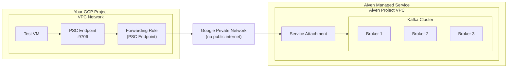

# Aiven Kafka with GCP Private Service Connect (PSC)

This Terraform configuration sets up an Aiven Kafka service with Google Cloud Private Service Connect (PSC), enabling secure, private connectivity between your GCP VPC and Aiven's managed Kafka service.

## Architecture Overview



**Connection Flow:**

| Step | From | To | Description |
|------|------|-----|-------------|
| 1 | Test VM | PSC Endpoint | Connect to `privatelink-kafka-xxx.g.aivencloud.com:9706` (resolves to PSC IP via /etc/hosts) |
| 2 | PSC Endpoint | Forwarding Rule | Traffic routed through GCP forwarding rule |
| 3 | Forwarding Rule | Service Attachment | Traverses Google's private backbone network |
| 4 | Service Attachment | Kafka Brokers | Aiven routes to the Kafka cluster |

**Key Point:** All traffic stays on Google's private network and never touches the public internet.

### Components Created

| Component | Description |
|-----------|-------------|
| **Aiven Project VPC** | VPC in Google Cloud for Aiven services |
| **Aiven Kafka** | 3-node Kafka cluster with PSC enabled |
| **Aiven GCP Privatelink** | Creates the service attachment for PSC |
| **PSC Connection Approval** | Approves the connection from your GCP project |
| **GCP PSC Subnet** | Dedicated subnet for Private Service Connect |
| **GCP VM Subnet** | Subnet for test VM and PSC endpoint IP |
| **GCP Forwarding Rule** | PSC endpoint connecting to Aiven's service attachment |
| **Test VM** | Ubuntu VM for testing Kafka connectivity |
| **Demo Topic** | Kafka topic with producer service for testing |

## Prerequisites

### Required Tools
- Terraform >= 1.0
- Google Cloud SDK (`gcloud`)
- Aiven CLI (optional, for verification)

### Required Credentials

1. **Aiven API Token:**
   ```bash
   # Get from Aiven Console → Account → Auth tokens
   export TF_VAR_aiven_token="your-token-here"
   ```

2. **Google Cloud Authentication:**
   ```bash
   gcloud auth application-default login
   ```

3. **Required GCP Permissions:**
   - `compute.networks.get`
   - `compute.subnetworks.create`
   - `compute.forwardingRules.create`
   - `compute.addresses.create`
   - `compute.instances.create`
   - `compute.firewalls.create`

## Quick Start

### 1. Clone and Configure

```bash
cd terraform

# Set Aiven token (never commit this to version control)
export TF_VAR_aiven_token="your-aiven-api-token"

# Copy and customize variables for your environment
cp terraform.tfvars.example terraform.tfvars
# Edit terraform.tfvars with your project-specific values
```

### 2. Initialize and Apply

```bash
terraform init
terraform plan
terraform apply
```

The apply takes approximately 15-20 minutes:
- Aiven VPC: ~1 minute
- Kafka cluster: ~7-10 minutes
- PSC setup and approval: ~6 minutes
- Test VM: ~30 seconds

### 3. Verify the Deployment

Run the status check script from the project root:

```bash
# Basic status check
./scripts/check-psc-status.sh

# Check status and consume messages
./scripts/check-psc-status.sh --consume 5
```

Expected output:
```
==========================================
1. PSC Connection State
==========================================
✓ PSC connection is ACCEPTED

==========================================
2. Connecting to VM and running checks...
==========================================

--- /etc/hosts mapping ---
✓ Privatelink hostname is mapped in /etc/hosts

--- TCP Connectivity ---
✓ TCP connection to <PSC_IP>:9706 succeeded

--- TLS Handshake ---
✓ TLS handshake successful (certificate received)

--- Kafka Producer Service ---
✓ kafka-demo-producer.service is running
```

## Key Outputs

After deployment, view outputs with:

```bash
terraform output
```

| Output | Description |
|--------|-------------|
| `privatelink_host` | Hostname for PSC connections (use this, not the public hostname) |
| `privatelink_port` | Port for PSC connections (9706) |
| `psc_endpoint_ip` | Internal IP of the PSC endpoint |
| `connection_state` | PSC connection status (should be `ACCEPTED`) |
| `ssh_command` | Ready-to-run gcloud SSH command |

## Testing Kafka Connectivity

### SSH to Test VM

```bash
# Use the generated command from terraform output
eval "$(terraform output -raw ssh_command)"
```

### Check Producer Service

```bash
sudo systemctl status kafka-demo-producer.service
sudo journalctl -u kafka-demo-producer.service -f
```

### Consume Messages

```bash
# Get the privatelink hostname from /etc/hosts
BROKER=$(grep privatelink /etc/hosts | awk '{print $2}')

sudo kafkacat -b "$BROKER:9706" -t <your-topic-name> -C \
  -X security.protocol=SSL \
  -X ssl.ca.location=/etc/kafka/certs/ca.pem \
  -X ssl.certificate.location=/etc/kafka/certs/access.crt \
  -X ssl.key.location=/etc/kafka/certs/access.key \
  -o beginning -c 10
```

### Produce a Test Message

```bash
BROKER=$(grep privatelink /etc/hosts | awk '{print $2}')

echo '{"test":"message","ts":"'$(date -Iseconds)'"}' | \
sudo kafkacat -b "$BROKER:9706" -t <your-topic-name> -P \
  -X security.protocol=SSL \
  -X ssl.ca.location=/etc/kafka/certs/ca.pem \
  -X ssl.certificate.location=/etc/kafka/certs/access.crt \
  -X ssl.key.location=/etc/kafka/certs/access.key
```

## Understanding PSC with Aiven

### Why Privatelink Hostnames Matter

Aiven provides two different hostnames for Kafka:

| Type | Hostname Pattern | Port | Use Case |
|------|-----------------|------|----------|
| **Public** | `kafka-xxx.g.aivencloud.com` | varies | Direct internet access |
| **Privatelink** | `privatelink-kafka-xxx.g.aivencloud.com` | 9706 | PSC connections |

**Important:** You must use the privatelink hostname for PSC connections. The TLS certificate is issued for this hostname, and SSL SNI must match.

### Connection Approval

Aiven requires **manual approval** for PSC connections. You can approve connections either:

**Option 1: Using Aiven CLI**

```bash
avn service privatelink google connection approve SERVICE_NAME \
  --privatelink-connection-id PRIVATELINK_CONNECTION_ID \
  --user-ip-address PSC_ENDPOINT_IP_ADDRESS
```

**Option 2: Using Terraform (Automated)**

```hcl
resource "aiven_gcp_privatelink_connection_approval" "psc_approval" {
  project         = var.aiven_project
  service_name    = aiven_kafka.kafka.service_name
  user_ip_address = google_compute_address.psc_endpoint.address
}
```

**Important Notes:**
- The connection will initially show as `pending-user-approval` status
- Approval provides the IP address for DNS record configuration
- The connection transitions from `user-approved` → `active` status

> **Note:** For multiple Private Service Connect connections, use the Aiven CLI to retrieve connection information for each `PRIVATELINK_CONNECTION_ID`.

### Connection States

| State | Description |
|-------|-------------|
| `pending` | Endpoint created in GCP, awaiting Aiven detection |
| `pending-user-approval` | Detected by Aiven, awaiting approval |
| `user-approved` | Approved, DNS records being configured |
| `active` | Fully operational |

## Troubleshooting

### Common Issues

- **After maintenance/upgrades:** PSC connections may need re-approval following Aiven service maintenance or upgrades
- **DNS resolution:** The privatelink hostname must resolve to your PSC endpoint IP (configured via `/etc/hosts` or Cloud DNS)
- **Multiple connections:** When using multiple PSC connections, use the Aiven CLI to retrieve connection information for each `PRIVATELINK_CONNECTION_ID`

### Connection State is PENDING

The PSC connection approval may not have completed:

```bash
# Check current state
terraform output connection_state

# If PENDING, ensure the approval resource exists
terraform plan

# Apply if the approval resource is missing
terraform apply
```

### SSL Handshake Fails

Usually caused by using the wrong hostname:

```bash
# Wrong (public hostname) - will fail
kafkacat -b kafka-xxx.g.aivencloud.com:12693 ...

# Correct (privatelink hostname) - will work
kafkacat -b privatelink-kafka-xxx.g.aivencloud.com:9706 ...
```

### Connection Timeout

1. Check TCP connectivity to the PSC endpoint:
   ```bash
   nc -zv $(terraform output -raw psc_endpoint_ip) 9706 -w 5
   ```

2. Verify `/etc/hosts` has the correct mapping on the VM:
   ```bash
   grep privatelink /etc/hosts
   ```

3. Check the PSC forwarding rule status:
   ```bash
   gcloud compute forwarding-rules describe $(terraform output -raw psc_forwarding_rule_name) \
     --region=$(terraform output -raw gcp_region 2>/dev/null || echo "us-central1") \
     --project=$(terraform output -raw gcp_project_id 2>/dev/null) \
     --format="value(pscConnectionStatus)"
   ```

### Producer Service Not Working

```bash
# Check service status
sudo systemctl status kafka-demo-producer.service

# View logs
sudo journalctl -u kafka-demo-producer.service -n 50 --no-pager

# Restart service
sudo systemctl restart kafka-demo-producer
```

## Cleanup

```bash
cd terraform
terraform destroy
```

**Warning:** This deletes all resources including the Kafka service and its data.

## Security Considerations

- **Never commit secrets:** The `.gitignore` excludes `*.tfvars` files and state files
- **Use environment variables:** Set `TF_VAR_aiven_token` as an environment variable, not in files
- **State file security:** Terraform state may contain sensitive values; use remote state with encryption for production
- **Certificate handling:** The demo passes certificates via VM metadata; use Secret Manager for production workloads

## File Structure

```
.
├── scripts/
│   └── check-psc-status.sh    # Status check script
├── terraform/
│   ├── main.tf                # Main resource definitions
│   ├── variables.tf           # Variable declarations
│   ├── outputs.tf             # Output definitions
│   ├── providers.tf           # Provider configurations
│   ├── versions.tf            # Version constraints
│   └── terraform.tfvars.example
├── .gitignore
└── README.md
```

## Cost Considerations

| Resource | Approximate Cost |
|----------|-----------------|
| Aiven Kafka | Based on selected plan |
| GCP PSC Endpoint | No additional charge |
| Test VM (e2-micro) | ~$5/month |
| Data Transfer | Standard GCP egress |

Set `enable_test_vm = false` to skip the test VM.

## Additional Resources

- [Aiven Private Service Connect Documentation](https://docs.aiven.io/docs/platform/howto/use-gcp-private-service-connect)
- [Google Cloud Private Service Connect](https://cloud.google.com/vpc/docs/private-service-connect)
- [Aiven Terraform Provider](https://registry.terraform.io/providers/aiven/aiven/latest/docs)
- [Google Terraform Provider](https://registry.terraform.io/providers/hashicorp/google/latest/docs)

## License

This project is provided as-is for demonstration purposes.
